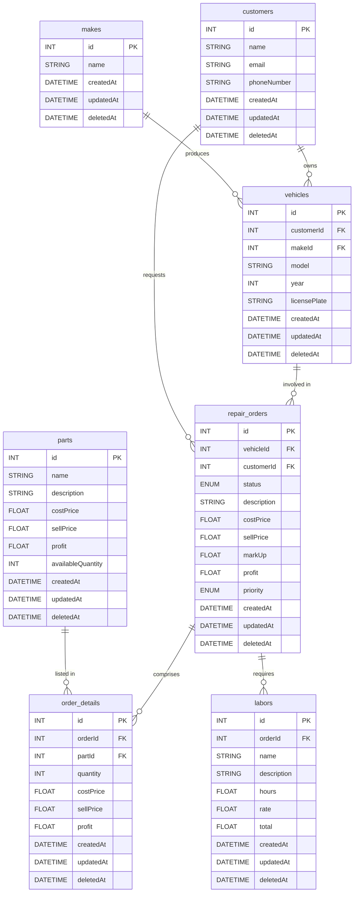

# AutoPartsPro

This repository contains my completed technical challenge for **auto-parts-pro**.  
The solution follows a **monolithic architecture** built entirely with **Next.js**.

**Production demo:** <https://senior-test.vercel.app>

**Demo video:** <https://youtu.be/A6r68_E3PaU>

---

## Tech Stack

| Layer | Tech | Why it was chosen |
|-------|------|-------------------|
| **Database** | **PostgreSQL** hosted on **Supabase** | Quick, fully-managed Postgres instance for rapid prototyping & easy scaling |
| **ORM** | **Prisma** | First-class TypeScript support and a great DX |
| **API** | **tRPC** + **react-query** | End-to-end type safety and built-in loading / error states |
| **Web Framework** | **Next.js** | File-system routing, hybrid SSR/SSG, and seamless full-stack TypeScript |
| **UI / Validation** | **Shadcn UI**, **Zod** | Accessible, unstyled UI primitives and robust schema validation |

---

### Front-end Highlights

- ⚡ **Next.js** pages and app router for a unified monolith  
- 💅 **Shadcn UI** components for consistent design without heavy CSS frameworks  
- ✅ **Zod** schemas shared between client and server for type-safe form validation  

### Back-end Highlights

- 🗄️ **PostgreSQL @ Supabase** for a managed, production-ready database  
- 🔄 **Prisma** for elegant data modeling and migrations  
- 🔌 **tRPC** with **react-query** to auto-generate type-safe hooks, handle caching, and manage request states  

---

## Database Documentation

The project uses **PostgreSQL**. Every table includes the audit columns  
`id`, `createdAt`, `updatedAt`, and `deletedAt`.

> **Soft deletes**  
> Instead of permanently removing rows, setting `deletedAt` implements a soft-delete so data can be recovered and historical queries remain intact.

---

### Naming Conventions

| Scope   | Style        | Example            |
|---------|--------------|--------------------|
| Tables  | `snake_case` | `repair_orders`    |
| Columns | `camelCase`  | `availableQuantity`|

---

### Schema Overview

| Table | Purpose | Key relationships / notes |
|-------|---------|---------------------------|
| **`customers`** | Stores customer information | Unique index ensures only **one active** (`deletedAt IS NULL`) row per email |
| **`makes`** | Catalog of vehicle manufacturers | — |
| **`vehicles`** | Vehicle records | References **customers** and **makes** |
| **`parts`** | Workshop inventory | Saves `purchasePrice`, `salePrice`, `profit`, and `stock` |
| **`repair_orders`** | Repair work orders | References **customers** and **vehicles** ↦ tracks `laborCost`, `partsCost`, `markup`, `priority`, and `status` (`pending`, `in_progress`, `completed`, `cancelled`) |
| **`order_details`** | Parts needed per repair | Junction table between **parts** and **repair_orders**; stores quantity plus **snapshots** of `purchasePrice` & `salePrice` to shield against future price changes |
| **`labors`** | Labor line-items | References **repair_orders**; stores `hours`, `hourlyRate`, and `total` |

---

### Entity-Relationship Diagram

> ⚠️ **Important note:** The `prisma-extension-soft-delete` library automatically handles records whose `deletedAt` field is set, and it also updates that field whenever the `destroy` function is invoked.

## Front-End Documentation

The UI follows the standard **Next.js App Router** layout. All public routes live inside the `/app` folder:

| Route | Purpose |
|-------|---------|
| `/` | **Dashboard** – run the optimizer and fetch the optimal repair-order set. |
| `/repair-orders` | **Repair Orders** – create new orders, inspect details, and update their status. |
| `/vehicles` | **Vehicles** – create, edit, or delete vehicle records. |
| `/customers` | **Customers** – create, edit, or delete customer records. |
| `/parts` | **Parts** – manage spare-part inventory (create, adjust stock, delete). |
| `/docs` | **API Docs** – interactive OpenAPI reference for every endpoint. |

### Key Directories

| Path | Contents |
|------|----------|
| `components/` | Reusable UI components—both **shadcn/ui** primitives and custom widgets used across the app. |
| `lib/` | Shared utilities such as `dayjs` helpers and form-validation schemas. |
| `server/` | Back-end API handlers and database connection logic. |
| `styles/` | Tailwind CSS configuration and global style sheets. |

### Walkthrough video

You can find a video demo of the app here: https://youtu.be/A6r68_E3PaU

## Back-End Documentation

The complete API reference lives inside the app itself:

**URL:** <https://senior-test.vercel.app/docs>

There you’ll find every endpoint together with its request/response schemas.

---

### Optimization Endpoint &nbsp;—&nbsp; _Optimal Repair Orders_

This endpoint returns the **best possible set of repair orders** while honoring current inventory limits.

Internally it builds a two-stage mixed-integer linear programming (MILP) model:

1. **Data loading**  
   * Fetch current stock for each spare part.  
   * Load all open repair orders, including their **profit**, **priority**, and required parts.  
   * Create:  
     - Inventory constraints, e.g. `part_x ≤ stock_x`  
     - One binary decision variable per order, `order_y ∈ {0, 1}`, used both in the **objective function**—maximizing total profit or priority weight—and in the parts-consumption constraints.

2. **Solving & post-processing**  
   * Run the solver to activate the optimal combination of decision variables.  
   * Parse the solution into three key pieces of information:  
     - **selectedOrders** – IDs of orders to process  
     - **skippedOrders** – IDs of orders deferred  
     - **objectiveValue** – optimal profit/priority achieved  
   * Recalculate inventory by subtracting only the selected orders.  
   * Return a compact JSON object that shows which orders will be processed, which will wait, and the resulting stock levels.