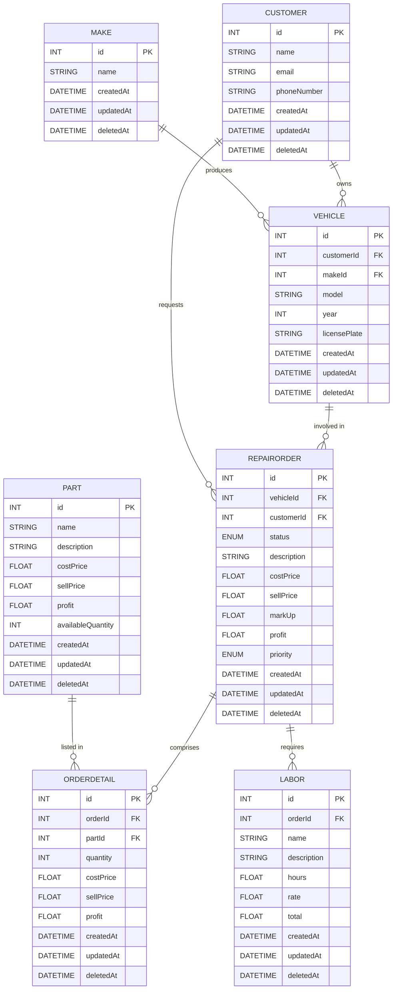

# AutoPartsPro

```mermaid
erDiagram
    CUSTOMER {
        INT      id PK
        STRING   name
        STRING   email
        STRING   phoneNumber
        DATETIME createdAt
        DATETIME updatedAt
        DATETIME deletedAt
    }

    MAKE {
        INT      id PK
        STRING   name
        DATETIME createdAt
        DATETIME updatedAt
        DATETIME deletedAt
    }

    VEHICLE {
        INT      id PK
        INT      customerId FK
        INT      makeId FK
        STRING   model
        INT      year
        STRING   licensePlate
        DATETIME createdAt
        DATETIME updatedAt
        DATETIME deletedAt
    }

    REPAIRORDER {
        INT      id PK
        INT      vehicleId FK
        INT      customerId FK
        ENUM     status
        STRING   description
        FLOAT    costPrice
        FLOAT    sellPrice
        FLOAT    markUp
        FLOAT    profit
        ENUM     priority
        DATETIME createdAt
        DATETIME updatedAt
        DATETIME deletedAt
    }

    PART {
        INT      id PK
        STRING   name
        STRING   description
        FLOAT    costPrice
        FLOAT    sellPrice
        FLOAT    profit
        INT      availableQuantity
        DATETIME createdAt
        DATETIME updatedAt
        DATETIME deletedAt
    }

    ORDERDETAIL {
        INT      id PK
        INT      orderId FK
        INT      partId FK
        INT      quantity
        FLOAT    costPrice
        FLOAT    sellPrice
        FLOAT    profit
        DATETIME createdAt
        DATETIME updatedAt
        DATETIME deletedAt
    }

    LABOR {
        INT      id PK
        INT      orderId FK
        STRING   name
        STRING   description
        FLOAT    hours
        FLOAT    rate
        FLOAT    total
        DATETIME createdAt
        DATETIME updatedAt
        DATETIME deletedAt
    }

    %% Relationships — crow’s-foot notation
    CUSTOMER   ||--o{ VEHICLE      : "owns"
    MAKE       ||--o{ VEHICLE      : "produces"
    VEHICLE    ||--o{ REPAIRORDER  : "involved in"
    CUSTOMER   ||--o{ REPAIRORDER  : "requests"
    REPAIRORDER||--o{ ORDERDETAIL  : "comprises"
    PART       ||--o{ ORDERDETAIL  : "listed in"
    REPAIRORDER||--o{ LABOR        : "requires"
```